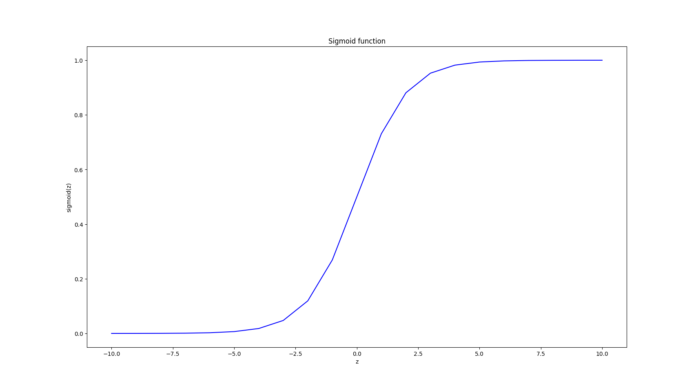
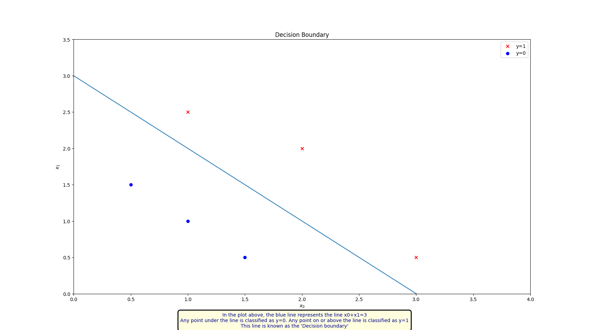
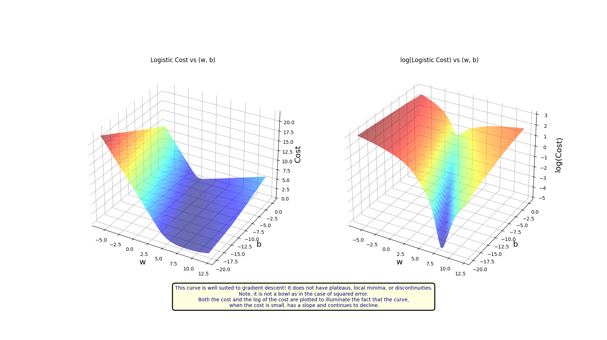
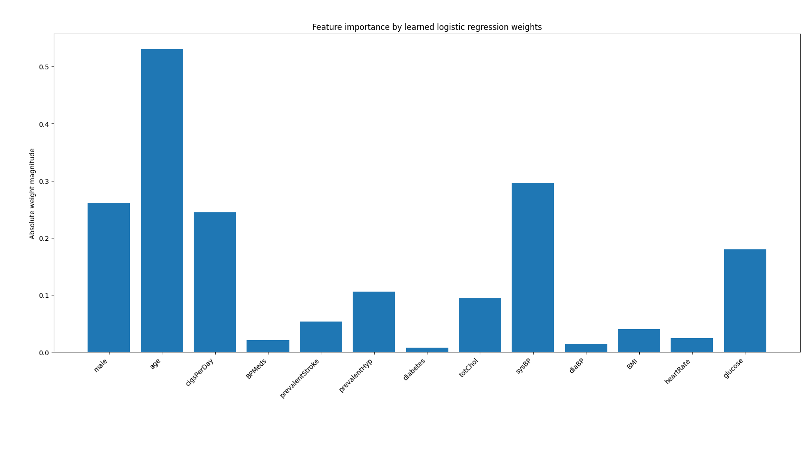
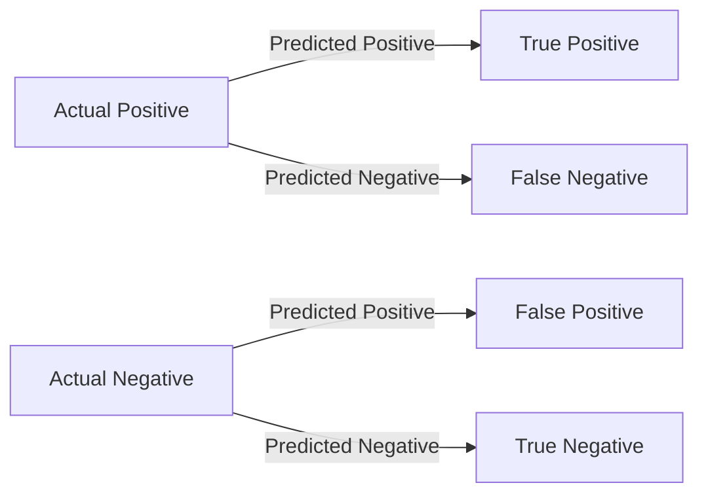
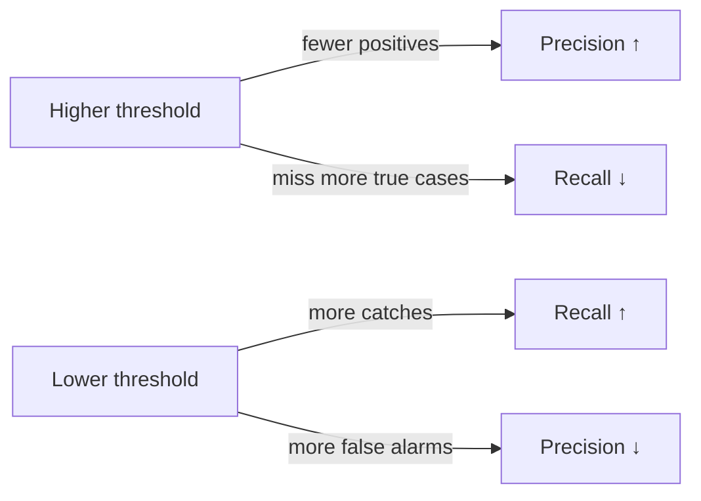

# 🫀 Heart Disease Prediction using Logistic Regression

This project explores logistic regression for predicting heart disease risk from the dataset in `predictHeartDisease.csv`. It compares two approaches:

- a from-scratch implementation trained with gradient descent,
- a scikit-learn baseline using `LogisticRegression`.

The goal is both practical and educational: to understand how logistic regression works under the hood while also seeing how a mature library implementation performs.

---

## 📌 Overview

Heart disease remains one of the leading causes of death worldwide, so early risk prediction can support better medical decisions and lifestyle changes. This project focuses on:

- building a logistic regression model from scratch,
- training it using gradient descent,
- evaluating performance with common classification metrics,
- and comparing the custom solution with scikit-learn.

---

## ✨ Highlights

- Manual gradient-descent implementation for learning the core math
- Numerically stable cost computation with `log_1pexp`
- Train/test split and normalization for more realistic evaluation
- Threshold tuning and metric reporting for better model understanding

---

## 🧪 What’s included

- `heart_disease_prediction_model_gd.py` — end-to-end example using a manually implemented logistic regression model trained with gradient descent.
- `heart_disease_prediction_model_sklearn.py` — scikit-learn version with train/test split, normalization, metrics, and threshold tuning.
- `logistic_utility_function.py` — helper functions for sigmoid, cost, gradient, and gradient descent.
- `logistic_regression_model.py` — a small toy example that visualizes a simple decision boundary.
- `basic_plot/` — small standalone plotting experiments.
- `images/` — visual assets used to illustrate the concepts.

---

## 🗂️ Project layout

```text
Logistic Regression/
├── heart_disease_prediction_model_gd.py
├── heart_disease_prediction_model_sklearn.py
├── logistic_regression_model.py
├── logistic_utility_function.py
├── basic_plot/
├── images/
├── predictHeartDisease.csv
└── README.md
```

---

## 📊 Dataset

The file `predictHeartDisease.csv` contains patient-related features and the target column `TenYearCHD`. The scripts:

- remove rows with missing values,
- split the data into training and testing sets,
- normalize features before fitting the model,
- and evaluate predictions using classification metrics.

---

## ▶️ Running the examples

From the `Logistic Regression` folder, run:

```bash
python heart_disease_prediction_model_gd.py
```

or

```bash
python heart_disease_prediction_model_sklearn.py
```

### Gradient-descent script

- loads the dataset,
- normalizes the feature matrix,
- trains the model using batch gradient descent,
- prints learned parameters,
- and plots the decision boundary and convergence behavior.

### Scikit-learn script

- loads the dataset,
- performs a train/test split while preserving class balance,
- fits normalization using the training set only,
- trains `LogisticRegression`,
- reports accuracy and classification metrics,
- evaluates several thresholds for precision/recall trade-offs,
- and shows feature importance using learned weights.

---

## 🔧 Implementation notes

- Normalization: features are standardized using z-score normalization to improve optimization stability.
- Numerical stability: the helper module uses `log_1pexp` to avoid overflow during logistic-loss computation.
- Feature scaling matters: any new sample must be scaled using the same training-set statistics used during fitting.
- Threshold tuning: because the dataset is imbalanced, a fixed threshold of `0.5` may not be optimal.

Key helper functions in `logistic_utility_function.py`:

- `sigmoid(z)` — logistic activation
- `log_1pexp(x, maximum=20)` — numerically stable approximation of `log(1 + exp(x))`
- `compute_cost_matrix(...)` — cost computation for logistic regression
- `compute_gradient_logistic(...)` — gradient calculation for gradient descent
- `gradient_descent(...)` — batch gradient descent trainer

---

## 🖼️ Visuals included

The following plots are available under `images/`:

- `Sigmoid_Function.png` — sigmoid/logistic activation curve
- `Decision_Boundary.png` — example 2D decision boundary
- `Logistic_Cost_Function.png` — convex logistic loss illustration
- `MSE_NonConvex_Function.png` — MSE composed with sigmoid (non-convex example)
- `Binary_Plots.png` — simple binary classification scatter plot
- `Feature_Importance.png` — learned-weight importance visualization
- `Feature_Histogram.png` — feature distributions by class
- `Model_Convergence.png` — cost vs iteration convergence plot

Example previews:









---

## 📈 Evaluation metrics

For binary classification, the project uses a few standard metrics:

- Accuracy: overall correctness of the predictions
- Precision: how many predicted positives are actually positive
- Recall: how many actual positives were detected
- F1-score: balance between precision and recall
- ROC-AUC: how well the model ranks positive cases above negative ones

It is also completely reasonable for the manually implemented gradient-descent model and the scikit-learn `LogisticRegression` model to achieve very similar accuracy. In many cases, the difference is more about optimization quality and numerical stability than about the underlying model concept.

### 📘 Definitions

#### 1. Accuracy

$$
\text{Accuracy} = \frac{TP + TN}{TP + TN + FP + FN}
$$

It tells us how often the model is correct overall.

#### 2. Precision

$$
\text{Precision} = \frac{TP}{TP + FP}
$$

It tells us how many of the predicted positives were truly positive.

#### 3. Recall

$$
\text{Recall} = \frac{TP}{TP + FN}
$$

It tells us how many actual positives were correctly identified.

#### 4. F1-score

$$
\text{F1-score} = 2 \times \frac{\text{Precision} \times \text{Recall}}{\text{Precision} + \text{Recall}}
$$

It balances precision and recall into a single score.

#### 5. ROC-AUC

ROC-AUC measures how well the model ranks positive cases above negative ones across all thresholds.

- AUC = 1.0: perfect classifier
- AUC = 0.5: random guessing
- AUC < 0.5: worse than random

### 🧠 Quick intuition





---

## 🌱 Next steps

- Compare the from-scratch model with the scikit-learn model on the same split
- Try class weighting or resampling to improve performance on the minority class
- Add cross-validation for a more robust evaluation
- Improve the custom optimizer with better learning-rate tuning and regularization

---

## 🧾 Minimal dependencies

```bash
pip install numpy matplotlib pandas
# optional for evaluation: pip install scikit-learn
```

---

## 👤 Author

Nikunj Thakur

