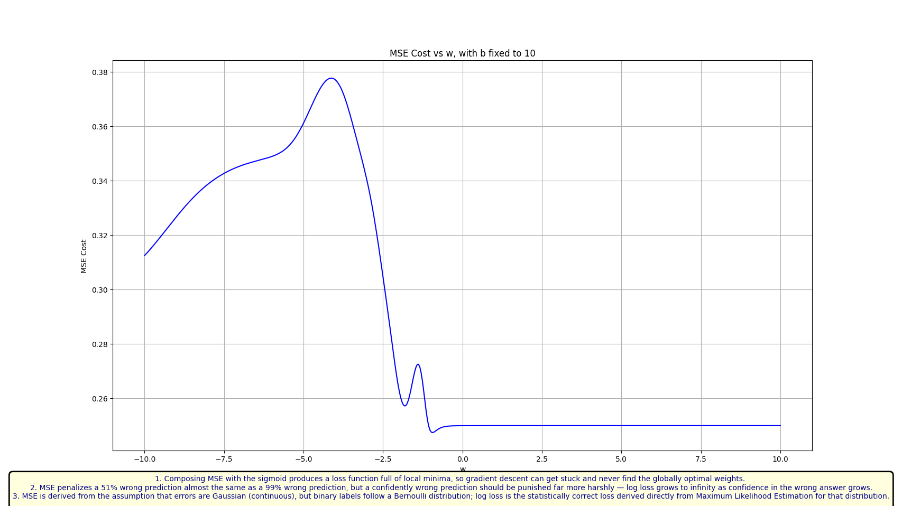
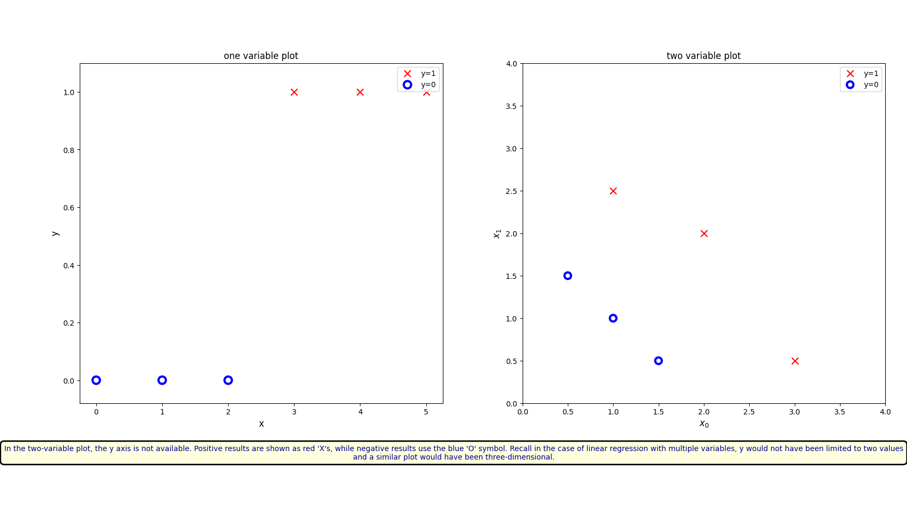
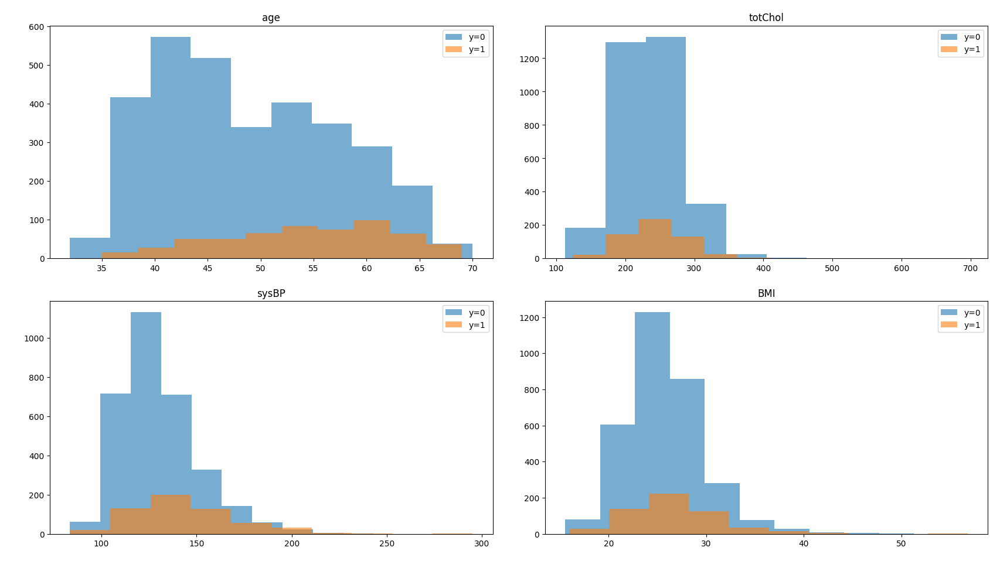
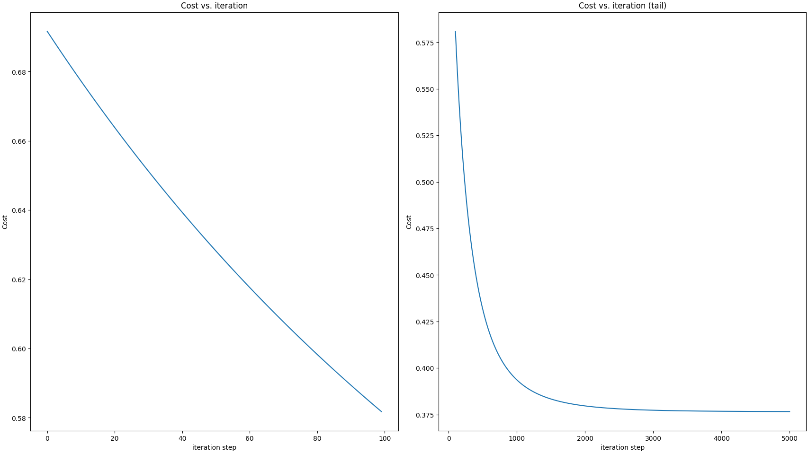
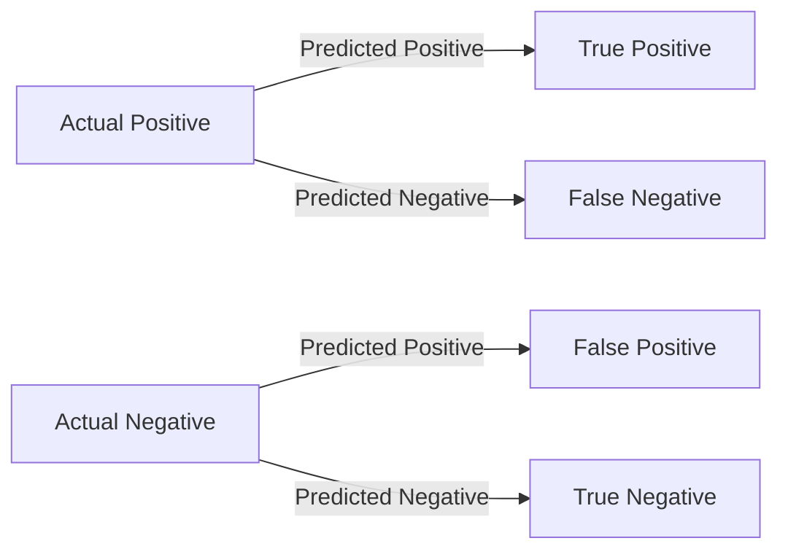
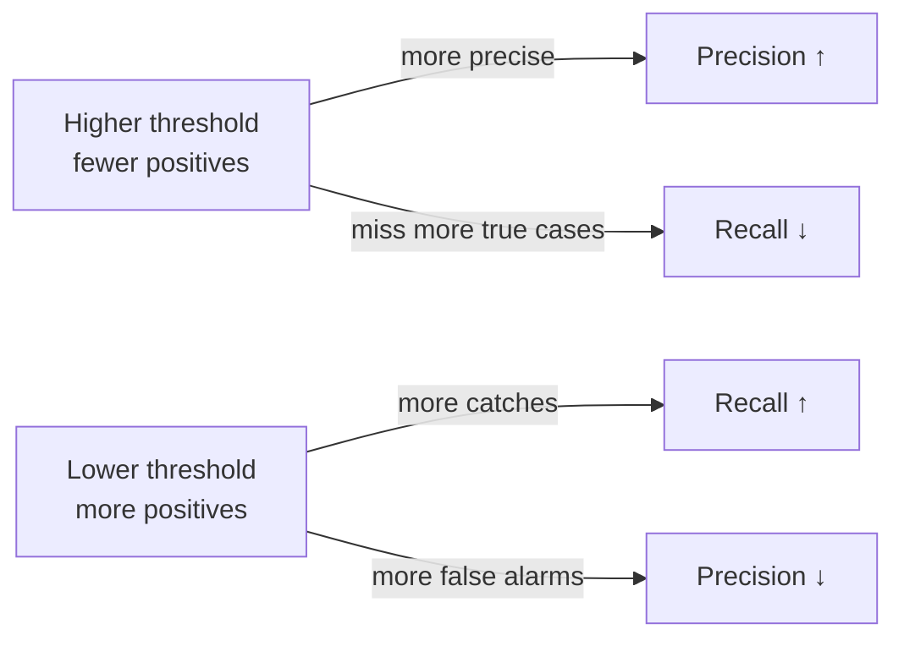
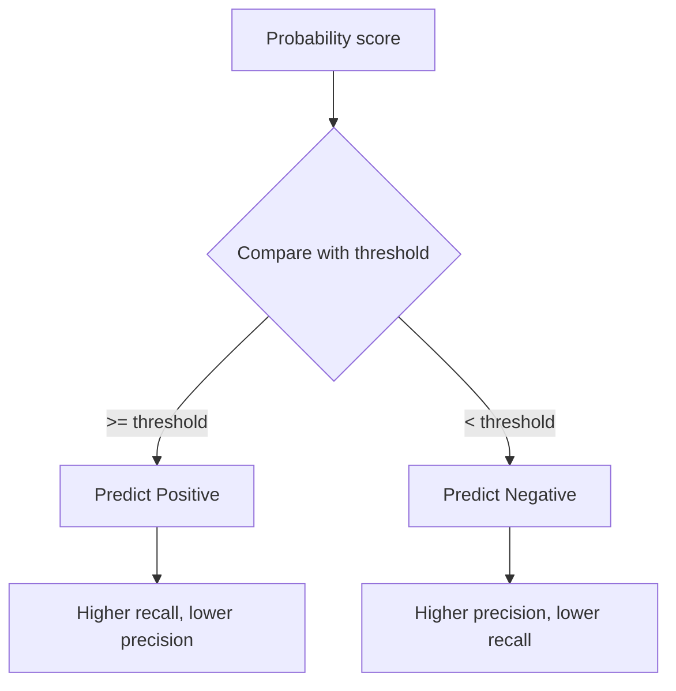

# Heart Disease Prediction using Logistic Regression

This repository implements a logistic regression model specifically for predicting heart disease risk using the `predictHeartDisease.csv` dataset.

**Introduction**

World Health Organization has estimated 12 million deaths occur worldwide every year due to heart diseases. Half the deaths in the United States and other developed countries are due to cardiovascular diseases. The early prognosis of cardiovascular diseases can aid in making decisions on lifestyle changes in high-risk patients and in turn reduce the complications.

This research intends to pinpoint the most relevant risk factors for heart disease as well as predict the overall risk using logistic regression.

The project demonstrates:

- a from-scratch logistic regression implementation,
- stable logistic cost computation,
- gradient descent training,
- feature importance and risk prediction for heart disease,
- evaluation with precision, recall, F1-score, ROC-AUC, and threshold tuning.

NOTE: This project is intended for learning and experimentation — for production or larger datasets prefer `scikit-learn`'s `LogisticRegression`.

---

## Quick overview

- `heart_disease_prediction_model.py` — end-to-end example using `predictHeartDisease.csv` (normalisation, training, plotting, single-record prediction, and threshold-based evaluation).
- `logistic_utility_function.py` — core math: `sigmoid`, `log_1pexp`, cost, gradient and `gradient_descent`.
- `images/` — visual assets used in the README.
- `basic_plot/` — small plotting experiments.

---

## Visuals included (from images/)

- `Sigmoid_Function.png` — sigmoid / logistic activation curve
- `Decision_Boundary.png` — example 2D decision boundary (toy 2-feature examples only)
- `Logistic_Cost_Function.png` — logistic loss (convex) illustration
- `MSE_NonConvex_Function.png` — MSE composed with sigmoid (non-convex example)
- `Binary_Plots.png` — toy binary scatter plot
- `Feature_Importance.png` — bar chart of absolute learned weights
- `Feature_Histogram.png` — per-feature histograms split by class
- `Model_Convergence.png` — cost vs iterations convergence plot

Inline previews:











---

## Project layout

```
Logistic Regression/
├── heart_disease_prediction_model.py
├── logistic_utility_function.py
├── basic_plot/
├── images/
└── predictHeartDisease.csv
```

---

## Implementation notes

- Normalisation: training features are z-score normalised (store `X_mean` and `X_std` and use them to scale any test/sample inputs before prediction).
- Numerical stability: `log_1pexp` is used when computing the log-loss to avoid overflow for large inputs.
- Gradient descent: a simple batch gradient descent is implemented; the gradient routine returns `(dj_db, dj_dw)` and the trainer applies updates accordingly.

Key functions in `logistic_utility_function.py`:

- `sigmoid(z)` — logistic activation
- `log_1pexp(x, maximum=20)` — numerically stable log(1+exp(x))
- `compute_cost_matrix(X, y, w, b, logistic=True, lambda_=0, safe=True)` — cost with optional L2 regularisation
- `compute_gradient_logistic(X, y, w, b)` — computes gradients returned as `(dj_db, dj_dw)`

---

## Running the example

From the `Logistic Regression` folder run:

```bash
python heart_disease_prediction_model.py
```

What the script does:

- Reads `predictHeartDisease.csv` and drops rows with missing values.
- Builds `X` by dropping the `TenYearCHD` column and `y` from `TenYearCHD`.
- Normalises `X`, trains via `gradient_descent`, and displays plots (feature importance, histograms and convergence).

Notes:

- If you regenerate plots programmatically, save them to `images/` with the exact filenames used here so the README previews remain valid.
- Any prediction using learned parameters must apply the same normalization used during training.

---

## Evaluation & class imbalance guidance

The example dataset contains approximately 15% positive examples (`TenYearCHD == 1`). With this imbalance:

- Overall accuracy can be misleading; prefer `precision`, `recall`, `F1-score`, and `ROC-AUC`.
- The current example evaluates several decision thresholds and reports how each changes the trade-off between false positives and false negatives.
- In the latest run, a threshold of `0.3` gave the best F1-score on the test set for this model.

Recommended quick approaches:

1. Use class weights (in scikit-learn or by applying per-sample weights in the gradient computation).
2. Oversample the minority class (SMOTE) or undersample the majority class.
3. Tune the decision threshold using ROC/PR curves to optimize the metric you care about.

Quick evaluation snippet (requires `scikit-learn`):

```python
from sklearn.model_selection import train_test_split
from sklearn.metrics import classification_report, roc_auc_score

X = df.drop(columns=['TenYearCHD']).values
y = df['TenYearCHD'].values
X_train, X_test, y_train, y_test = train_test_split(X, y, test_size=0.2, stratify=y, random_state=0)

# normalize X_train and X_test using X_train mean/std, train the model on X_train_norm
# compute probabilities on X_test_norm: y_prob = sigmoid(X_test_norm.dot(w) + b)
# choose a threshold to get y_pred and then:
print(classification_report(y_test, y_pred))
print('ROC AUC:', roc_auc_score(y_test, y_prob))
```

---

## Metrics at a glance

These diagrams summarize the core ideas behind the evaluation metrics used in this project.

### 1. Confusion matrix intuition



### 2. Precision vs recall trade-off



### 3. How threshold changes the decision boundary



### 4. Quick metric summary

- Accuracy: overall correctness
- Precision: how many predicted positives were actually positive
- Recall: how many actual positives were correctly detected
- F1-score: balance between precision and recall
- ROC-AUC: ranking quality across all thresholds

## Accuracy, Precision, Recall and F1-score

For binary classification, these metrics are computed from the confusion matrix:

- True Positive (TP): correctly predicted positive
- True Negative (TN): correctly predicted negative
- False Positive (FP): predicted positive but actually negative
- False Negative (FN): predicted negative but actually positive

### 1. Accuracy

$$
\text{Accuracy} = \frac{TP + TN}{TP + TN + FP + FN}
$$

It tells us how often the model is correct overall.

### 2. Precision

$$
\text{Precision} = \frac{TP}{TP + FP}
$$

It tells us how many of the predicted positives were truly positive.

### 3. Recall

$$
\text{Recall} = \frac{TP}{TP + FN}
$$

It tells us how many of the actual positives were correctly identified.

### 4. F1-score

$$
\text{F1-score} = 2 \times \frac{\text{Precision} \times \text{Recall}}{\text{Precision} + \text{Recall}}
$$

It is the harmonic mean of precision and recall, useful when you want a single score that balances both.

### Example

Suppose a model gives the following results:

- TP = 10
- FP = 2
- FN = 3
- TN = 85

Then:

- Accuracy = $(10 + 85) / (10 + 85 + 2 + 3) = 95 / 100 = 0.95$
- Precision = $10 / (10 + 2) = 10 / 12 = 0.833$
- Recall = $10 / (10 + 3) = 10 / 13 = 0.769$
- F1-score = $2 \times (0.833 \times 0.769) / (0.833 + 0.769) \approx 0.80$

So, the model has an accuracy of 95%, precision of 83.3%, recall of 76.9%, and an F1-score of 80%.

## ROC-AUC

ROC-AUC stands for Receiver Operating Characteristic - Area Under the Curve.

It measures how well a binary classification model can distinguish between the two classes across all possible thresholds.

### Intuition

- The model outputs a probability score for each sample.
- We sort these scores from highest to lowest and vary the decision threshold.
- At each threshold, we compute the true positive rate and false positive rate.
- The ROC curve plots true positive rate against false positive rate.
- AUC is the area under that curve.

### Interpretation

- AUC = 1.0: perfect classifier
- AUC = 0.5: random guessing
- AUC < 0.5: worse than random

In practice:

- Higher AUC means the model ranks positive cases higher than negative cases more often.
- It is especially useful when the dataset is imbalanced and accuracy alone may be misleading.

### Simple example

If a model gives higher scores to actual heart disease cases than to healthy cases most of the time, its ROC-AUC will be high, such as 0.85 or 0.90.

This means the model is good at separating the two classes, even if the exact threshold chosen for predictions changes.

### Quick scikit-learn example

```python
from sklearn.metrics import roc_auc_score

# y_true contains the actual labels (0 or 1)
# y_prob contains predicted probabilities for class 1
score = roc_auc_score(y_true, y_prob)
print("ROC AUC:", score)
```

## Suggested next steps

1. Add a `train_eval.py` script to perform a proper `train_test_split`, evaluate metrics and save plots.
2. Implement `class_weight` support in the trainer to handle imbalance without resampling.
3. Tune the model further with regularisation and a wider threshold search.
4. Add automated tests that ensure the example script runs and key outputs (cost decreases, shapes match).

---

## Minimal dependencies

```bash
pip install numpy matplotlib pandas
# optional for evaluation: pip install scikit-learn
```

---

## Author

Nikunj Thakur

